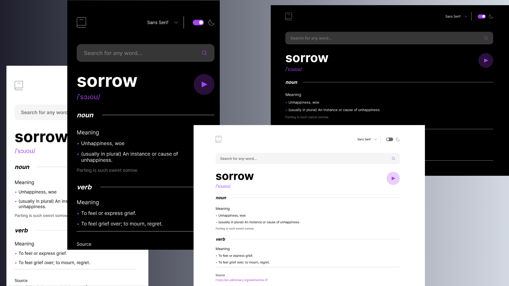

# Dictionary Website 🌐📖

A clean and functional dictionary web application built using HTML, CSS, and JavaScript. This project was developed as a learning exercise to practice DOM manipulation, `fetch()` API integration, and dynamic UI rendering based on real-time data from a public dictionary API.

---

## 🔍 Overview

This web app allows users to search for any English word and displays its definitions, phonetics, parts of speech, and pronunciation audio using the [`dictionaryapi.dev`](https://dictionaryapi.dev/) API. It was developed with a strong focus on DOM manipulation, event handling, and asynchronous JavaScript.

---

## 🚀 Live Links

- 🔗 **Live on Vercel**: [https://dictionary-website.vercel.app](https://vercel.com/ifaixals-projects/dictionary-website/AfiYuRFv6Bm5ZDhrBhKaruuAqzMy)
- 🗂️ **GitHub Repository**: [https://github.com/ifaixal/DictionaryWebsite](https://github.com/ifaixal/DictionaryWebsite)

---

## 📸 Screenshot

> 

---

## 🎯 The Challenge

Build a responsive and user-friendly dictionary web application that:

- Accepts input from users for a word to search.
- Fetches word definitions and related data from an external API.
- Handles asynchronous calls gracefully.
- Dynamically updates the DOM with the returned data.
- Includes audio playback for pronunciation.
- Provides useful error messages when a word is not found.

---

## 🛠️ Built With

- **JavaScript (ES6)**
- **HTML5**
- **CSS3**
- [`dictionaryapi.dev`](https://dictionaryapi.dev/) – Free dictionary API
- **Fetch API** – for making HTTP requests
- **Vercel** – for live deployment

---

## 🧠 What I Learned

- Using `fetch()` to retrieve data from an API
- Parsing and safely accessing nested JSON data
- Creating dynamic elements and injecting them into the DOM
- Handling errors and empty states in the UI
- Audio playback using the `<audio>` element and JavaScript
- Structuring a modular and readable JavaScript project

---

## 🔧 Continued Development

- [ ] Improve accessibility for screen readers
- [ ] Add light/dark mode toggle
- [ ] Create responsive dropdown for font selection
- [ ] Enhance error handling and styling

---

## 🧰 Useful Resources

- [dictionaryapi.dev](https://dictionaryapi.dev/)
- [MDN Web Docs - Fetch API](https://developer.mozilla.org/en-US/docs/Web/API/Fetch_API)
- [Modern CSS - Custom Select Dropdown](https://moderncss.dev/custom-select-styles-with-pure-css/)
- [How TO - Toggle Switch](https://www.w3schools.com/howto/howto_css_switch.asp)
- [Vercel](https://vercel.com) – Hosting platform

---

## 🙋‍♂️ Author

- GitHub: [@ifaixal](https://github.com/ifaixal)
- Frontend Developer in training, focused on mastering the DOM, asynchronous JS, and building standout projects during my learning journey.
- Learning MERN Stack

---

## 🙏 Acknowledgments

- Inspired by the [Frontend Mentor Dictionary App Challenge](https://www.frontendmentor.io).
- Thanks to [dictionaryapi.dev](https://dictionaryapi.dev/) for the free API.
- Shout-out to the dev community and mentors who provide support and guidance!

---
